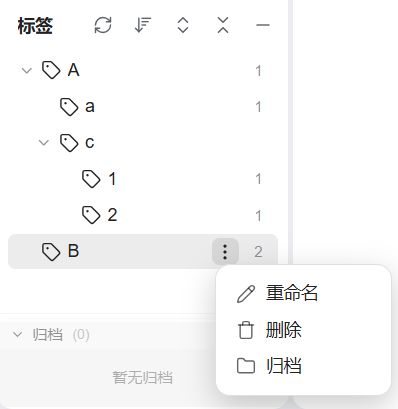
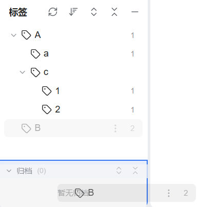
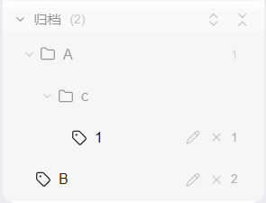
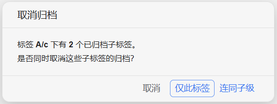
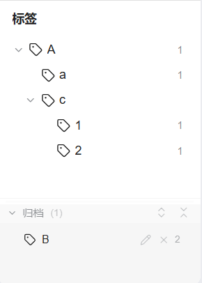
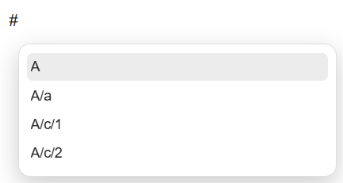
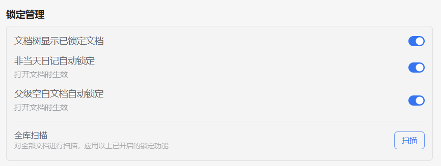
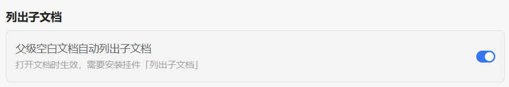
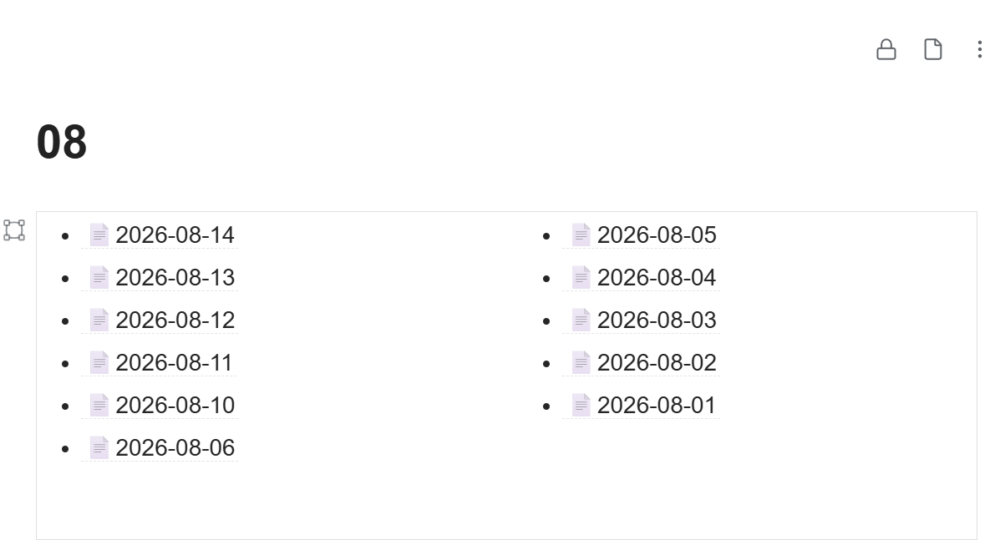

代码全程由Deepseek编写，谨慎使用。

# 使用说明

## 1、标签归档

使用场景：避免读过的书标签、废弃的旧标签等占用标签栏位置。

### 归档方式

- 点击菜单按钮或右键，选择归档；

  

- 拖动标签至归档栏。

  

### 特殊情况

- 父标签未归档的，在归档栏显示为灰色。

  

- 父标签归档，子标签一并归档。
- 父标签取消归档，可选择仅父标签取消或连同子标签一同取消。

  
- 子标签取消归档，已归档的父标签自动取消归档。

### 其他说明

- 归档后，标签不再出现在标签栏

  

  和输入 <kbd># </kbd> 后的联想补全窗口。

  

- 归档标签可改名和取消归档，显示引用数。
- 归档栏配置独立的展开、折叠按钮，但排序与标签栏一同变动。

## 2、锁定管理

在设置中选择性开启。

- 文档树显示已锁定文档。

  

- 非当天日记自动锁定：打开非当天日记时，自动锁定。使用场景为避免误修改非当天日记。
- 父级空白文档自动锁定：打开有子文档的父级文档时，自动锁定。使用场景为父级文档无需内容或仅需目录，尤其是日记的年月文档。
- 全库扫描：扫描全部文档，应用已开启的功能。使用场景为初次使用插件，或查缺补漏。

## 3、自动列出子文档

在设置中选择性开启，需要先安装挂件「列出子文档」。

打开有子文档的父级文档时，若为空白文档(忽略空段落和空格)，自动添加挂件「列出子文档」。

设置会沿用挂件的默认设置，无视锁定。该功能优先级高于「父级空白文档自动锁定」。

使用场景为自动将空白父文档转化为目录文档，尤其是日记的年月文档。

可能由于挂件本身的限制，无法进行全库扫描。